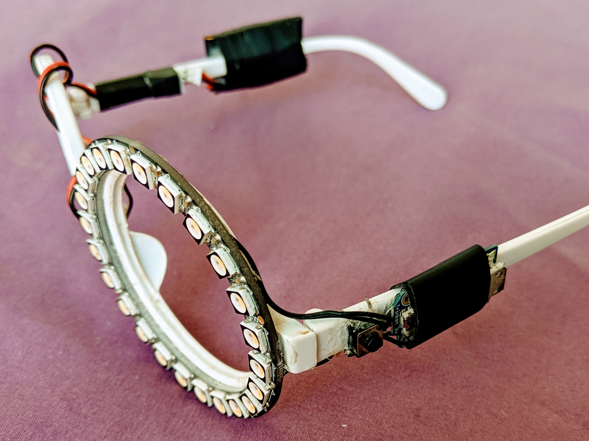

# MonocLED

## What is this?

This project controls a NeoPixel array to display a variety of patterns in a
non-blocking way with a debounced button to cycle display modes. It serves a
general purpose but it was initially created to drive an LED Monocle with 1
NeoPixel RGBW ring.



There are currently 4 modes to pick from: Comet, Bounce, Hippy, and Melt.

This platform has been very durable and has been used for over 3 years in many
adverse conditions, if you have suggestions or have built one yourself I would
love to hear about it! Feel free to send me an email or PR.

## How to build one

This project is a great introduction to microcontrollers and self contained
wearable technology. It has a low cost and uses only simple tools, if you can
handle through-hole soldering and epoxy then you can build this!

### Tools
+ Soldering Iron and workstation
+ Solder
+ E600 Epoxy
+ Electrical Tape
+ Flush-cutter

### Parts
+ Adafruit Trinket - Mini Microcontroller - 3.3V Logic (MicroUSB) [[ID:1500](https://www.adafruit.com/product/1500)]
+ NeoPixel Ring - 24 x 5050 RGBW LEDs [[ID:2863](https://www.adafruit.com/product/2863)]
+ Adafruit Micro Lipo - USB LiIon/LiPoly charger (v1) [[ID:1304](https://www.adafruit.com/product/1304)]
+ Silicone Cover Stranded-Core Wire - 2m 30AWG [[ID:2003](https://www.adafruit.com/product/2003)]
+ Lithium Ion Polymer Battery - 3.7v 350mAh [[ID:2750](https://www.adafruit.com/product/2750)]
+ Tactile Button switch (6mm) [[ID:367](https://www.adafruit.com/product/367)]
+ JST-PH Battery Extension Cable - 500mm [[ID:1131](https://www.adafruit.com/product/1131)]
+ Circular Costume Glasses [[Amazon](https://www.amazon.com/gp/product/B00HT0BD0A)]

Everything except for the glasses is on Adafruit. None of the above links are
affliate links, just for your convenience.

### Build

Using the above parts and the provided ciruit diagram below I would suggest
following this build order. Note that the Trinket and NeoPixel ring should be on
the same side of the monocle with the Lipo battery on the other in order to have
an even distribution of weight.

Note that this build is very similar to the [NeoPixel LED Goggles](https://learn.adafruit.com/kaleidoscope-eyes-neopixel-led-goggles-trinket-gemma)
project on the Adafruit site if you are looking for more details.

1. Solder the lead wires to the Trinket.

   These should be overly long and be cut to size later. You will need to attach
the following leads: One (1) to pin #0 for data output, one (1) to pin #2 for
the button, one (1) to +BAT for power, and two (2) to GND for the button and
battery.

2. Wrap the battery and Trinkey in electrical tape.

   This is just to prevent a mess and to avoid applying epoxy directly to the
components.

3. Prepare the button by pulling apart the leads until it snuggly fits on the
arm of the glasses.

4. Connect the button to pin #2 and GND with the correct length of wire.

   This can be tricky since the wires are short, just be patient.

5. Epoxy the button and Trinket to the arm of the glasses and wrap the Trinket
in another securing layer of tape.

6. Epoxy the battery and JST-PH battery extension to the opposite arm of the
glasses, wrapping in another layer of tape.

7. Epoxy the NeoPixel ring to the lens of the glasses, paying special attention
to not cover any of the solder points.

8. Cut the leads to their final length.

9. Solder the battery and Trinket to the NeoPixel ring.

   From the battery to the ring, +BAT to 5V and -BAT to GND. From the Trinket to
the ring again +BAT to 5V and GND to GND, also connect pin #0 to Data Input.

10. Flush cut any exposed leads and secure loose wires in place.

11. Connect the Trinket via USB and upload the included monocled.ino project.

12. Disconnect the USB then connect the JST-PH connector which acts as the main
power control and enjoy!


```
  ┌--------┐                           
  | Button |
  └--+--+--┘    ┌-----------------┐    ┌-------[[----------------┐
     |  |       |                 |    |   JST-PH Connector      |
  ┌--┘  ├-------┘   ┌---------┐   |    |   ┌---[[----┐           |
  |     |           |         |   |    |   |         |           |
  |  ┌--+-----------+---┐  ┌--+---+----+---+--┐  ┌---+-----------+---┐
  |  | GND         +BAT |  | 5V  GND  GND  5V |  |  +BAT        GND  |
  |  |   Trinket 3.3V   |  |  NeoPixel  Ring  |  | 3.7V Lipo Battery |
  |  | Pin#2      Pin#0 |  | Input     Output |  |                   |
  |  └---+----------+---┘  └---+----------+---┘  └-------------------┘
  |      |          |          |
  └------┘          └----------┘

```

To charge simply connect the USB LiPoly charger to a 5V USB charger
and connect the battery's JST-PH connector. The battery life is about 8-10 hours
depending on the mode used.

## Next Steps

Now that you have a working LED Monocle of your own you can dive into
the provided Arduino compatible C code and create your own modes! There is
documentation provided to accomplish this in [monocled.ino](monocled.ino).

GNU Public License v3.0
Alex Troesch (c) 2016
